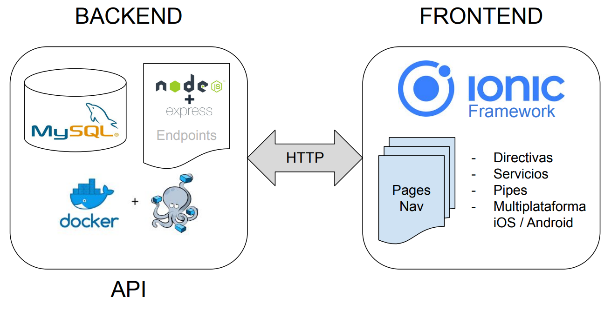
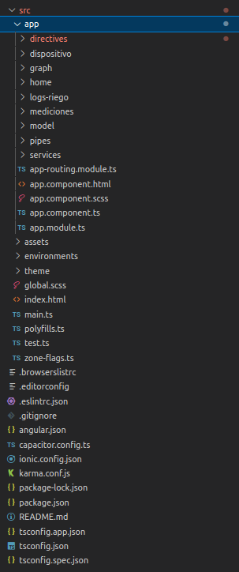
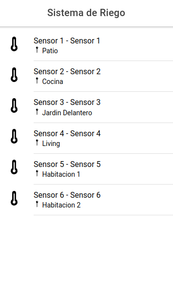
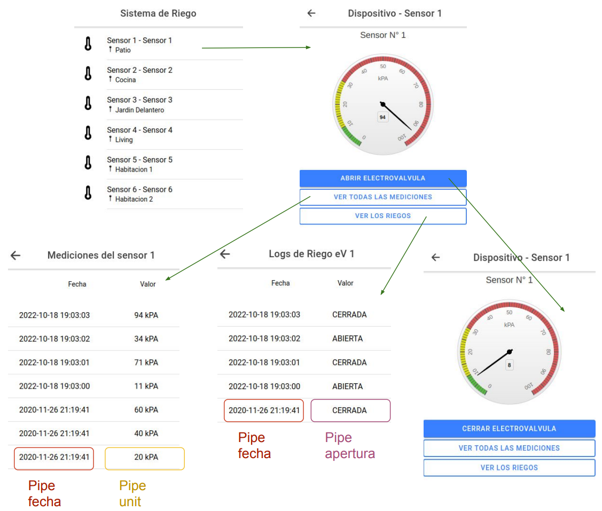
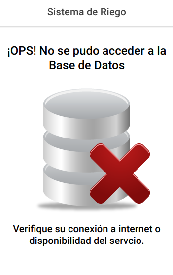
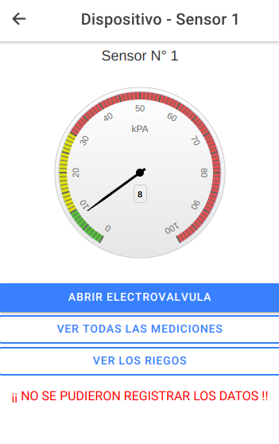

# TP-DAM-FINAL-Frontend

## Descripción de la aplicación 

La aplicación a desarrollar es un sistema de riego el cual utiliza sensores ubicados en distintos puntos.
Estos sensores consisten en un medidor de vacío y un tubo sellado con una capa de cerámica porosa.
La capa de cerámica simula movimiento del agua a través del suelo. Mientras más seco se encuentra el suelo, más alta será la lectura del tensiómetro.
La interpretación de la lectura de un tensiómetro varía según el cultivo, el tipo de suelo y curva de humedad correlacionada. 
En función de la lectura obtenida se debera realizar el riego del cultivo mediante el accionamiento de una electroválvula.

### Estructura

La aplciación está compuesta por un Frontend y un Backend. El Frontend se encuentra dockerizado en un docker compose que contiene las imágenes por medio de la cuales se implementa la bases de datos MySQL y el entorno de ejecución de JavaScript NodeJS necesarios para la implementación de la API. 

El BackEnd esta desarrollado en Ionic Framework, con el fin de brindar una agradable experiencia al usuario y la posibilidad de su implementación multiplataforma.

La comunicación entre el Backend y Frontend se realiza por medio del protocolo HTTP utilzando los métodos GET y PUT.


   
   
### Descargar el código

Para descargar el código, lo más conveniente es que realices un `fork` de este proyecto a tu cuenta personal haciendo click en [este link](https://github.com/chelogithub/TP-DAM-FINAL-Frontend/fork). Una vez que ya tengas el fork a tu cuenta, descargalo con este comando (acordate de poner tu usuario en el link):

```
git clone https://github.com/USER/TP-DAM-FINAL-Frontend.git
```

> En caso que no tengas una cuenta en Github podes clonar directamente este repo.

### Requisitos para el Frontend

El framework de `ìonic` requiere versiones de node js superiores a la 12, si no sabes la versión que tenés instalada o que versión descargar, recomiendo que instales el `nvm Node Version Manager`, esta herramienta presenta una linea de comandos amigable para instalar la versión de node que necesitas para correr ionic.

### Organización del proyecto

En la siguiente ilustración podés ver cómo está organizado el proyecto.



Los componentes principales del proyecto en ionic son 

1. Pages: Paginas que se visualizan al navegar por la aplicación, están compuestas por 5 archivos ( htmls, scss, page.ts, module.ts. routing.module.ts)
2. Servicios: Métodos que se encuentran diponibles para las distintas pages, en el caso de nuestra aplicacion `ApiConnService` accede a los endpoints expuestos en el backend. Por otro lado el servicio `timestamp`, aplica formato a los datos de fecha para poder almacenarlos en la base de datos. 
3. Pipes: Se encargan de alterar la forma en la que se visualizan los datos en el html sin alterarlos en el origen (son como una mascara). 
4. Directivas: Se encargan de realizar cambios en el DOM html de forma reactiva, en nuestro proyecto se realiza el cambio de color del nombre del dispositivo del listado de dispositivos cuando el mouse pasa por encima del mismo.

Iremos viendo algunos en detalle al adentrarnos en la apliacaión

### Poner en marcha el Frontend

Para poner en marcha el Backend debemos ejecutar  el comando `ionic serve` desde la raíz del proyecto. Este comando va a arrancar el Frontend en la siguiente direcciòn http://localhost:8100. Donde aparecerá la siguiente pantalla.



El acceso a esta vista implica la comunicación con la base de datos para obtener la lista de dispositovos que se ha graficado. Dicha comunicación se realiza a través de un servicio denominando `ApiConnService` el cual se encarga de realizar todas las consultas a la base de datos consultando los endpoints expuestos en el Backend.

### El servicio

Métodos en api-conn.service.ts
```js
 getDispositivo(id): Promise<Dispositivo> {

    this.dispositivo = this._http.get<Dispositivo>('http://localhost:8000/api/dispositivo/'+ id).toPromise();
    return this.dispositivo;
  }
  getDispositivos(): Promise<Array<Dispositivo>> {

    this.dispositivos = this._http.get<Array<Dispositivo>>('http://localhost:8000/api/dispositivo/').toPromise();
    return this.dispositivos;
  }

  getUltimaMedicion(id): Promise<Medida>  {
    this.medicion = this._http.get<Medida>('http://localhost:8000/api/medicion/' + id).toPromise();
    return this.medicion;
   }

   getMediciones(id): Promise<Array<Medida>> {
    this.mediciones = this._http.get<Array<Medida>> ('http://localhost:8000/api/medicion/' + id +'/todas/').toPromise();
    return this.mediciones;
   }

   getLogsRiego(id): Promise<Array<Log>> {
    this.logs = this._http.get<Array<Log>> ('http://localhost:8000/api/logRiego/' + id).toPromise();
    return this.logs;
   }

   getLogsRiegoEv(id): Promise<Log> {
    this.logEv = this._http.get<Log> ('http://localhost:8000/api/logRiego/' + id + '/estado').toPromise();
    return this.logEv;
   }
   postLogRiego(estadoEv,fechadate,ev): Promise<any> {
    const body ={'apertura': estadoEv,'fecha': fechadate ,'electrovalvulaId':ev};
    return this._http.post<any>('http://localhost:8000/api/logRiego/add',body).toPromise();
  }
  postMedicion(fechadate,valorMed,dispId): Promise<any> {
    const body ={'fecha': fechadate,'valor': valorMed,'dispositivoId':dispId};
    return this._http.post<any>('http://localhost:8000/api/medicion/add',body).toPromise();
  }
```
Ejemplo de llamada a servicio desde page dispositivo.page.ts

```js
   async obtenerDatos()
   {

    this.data=this.activatedRoute.snapshot.paramMap.get('id');

    try{

           this.med = await this.conndb.getUltimaMedicion(this.data);
           this.medFunca = this.med.valor;
           this.dispositivo = await this.conndb.getDispositivo(this.data);
           this.electrovalvula=this.dispositivo.electrovalvulaId;
           this.nombre=this.dispositivo.nombre;
           this.evEstado = await this.conndb.getLogsRiegoEv(this.electrovalvula);
           this.estadoElectrovalvula=this.evEstado.apertura;
      }
      catch (error)
      {
        this.dbStatus=false;
      }
   }
```

### Navegación por el FrontEnd

Te damos un breve vistazo por el layout de navegación del FrontEnd donde porás observar las pages que se encuentran disponibles y cual es su circuito.



En el caso de haber problemas con la conectividad el Backend aparecerán las siguientes pages, indicando la falla.



Falla durante el accionamietno de electroválvula



### Pipes

### Directiva


